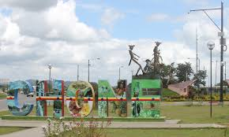
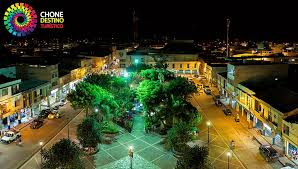

<!DOCTYPE>
 <HTML>
  <HEAD>
   <TITLE>HOME.com</TITLE>
  </HEAD>
    <BODY BGCOLOR="PURPLE">
     <h1 STYLE="COLOR:GREEN;FONT-SIZE:80PX;FONT-FAMILY:ARIAL"ALIGN="CENTER"><U>CHONE</U></H1>
      
<del>Tiene una superficie de 3.570 kilómetros cuadrados, ocupando un vasto territorio en el centro norte de la provincia manabita.
 
Es uno de los principales motores económicos de la provincia a través de actividades como la agricultura, el comercio y la ganadería, este último rubro convierte al cantón en el primer centro ganadero provincial, con cerca de 300 mil cabezas de ganado vacuno, adaptadas a las duras condiciones de la montaña tropical.
 
En el cantón también se cultiva cacao fino de aroma, cuya producción es exportada, en su mayoría hacia países de Europa, como Alemania y Francia, donde su grano es muy apetecido.
 
Sus grandes montañas permiten la realización de excursiones y paseos de aventura, donde los turistas descubren exuberantes bosques y caídas de agua; son sitios ideales para la observación de flora y fauna, y de especial interés para ornitólogos y naturalistas.
 

<del>El río Chone es el principal de la región, junto a sus afluentes Garrapata, San Lorenzo y Tosagua, que nacen en las partes altas de los cantones Bolívar y Junín, que a su paso, permiten el desarrollo agrícola y ganadero del cantón.
 
A su desembocadura en la Bahía de Caráquez, da lugar a la formación de un estuario de espectacular belleza y diversidad.
 
La ciudad de Chone, que es la capital del cantón, conocida también como La Ciudad de los Naranjos en Flor, es una ciudad dinámica y hospitalaria. Fue fundada el 7 de agosto de 1735 por el religioso portovejense Fray José Antonio Cedeño, y bautizada como Villa de San Cayetano de Chone, habiendo ganado un gran prestigio a nivel nacional por ser cuna de bellas mujeres y hombres bravíos.
 
En los alrededores de Chone se puede encontrar interesantes sitios para descubrir y disfrutar de la naturaleza.
 
Hacia el norte de la ciudad, en la vía a El Carmen, se encuentra el sitio La Dibujada, Consta de unas grandes cuevas con inscripciones sobre piedra o petroglifos representando hombres y animales, cuya antigüedad y procedencia están por determinarse a pesar de que los vestigios arqueológicos encontrados en el sito, indican que pudieron haber sido realizados por las tribus Ñauzas y Chunos.
       </del>

 
       <iframe width="560" height="315" src="https://www.youtube.com/embed/-y9Xso3f3mE?si=VpBY0nt7VeOp6_Ie" title="YouTube video player" frameborder="0" allow="accelerometer; autoplay; clipboard-write; encrypted-media; gyroscope; picture-in-picture; web-share" referrerpolicy="strict-origin-when-cross-origin" allowfullscreen></iframe>
        <table border="3px">
           <tr>
          <td>CHONE</td>
          <td><a href="C:\Users\Mirella Yagual\OneDrive\Desktop\tareas de diseño\Farias Chone">SITIO GEOGRÁFICO</a></td>
          <td><a href="C:\Users\Mirella Yagual\OneDrive\Desktop\tareas de diseño\Farias Chone">SITIOS TURÍSTICOS</a></td>
          <td><a href="C:\Users\Mirella Yagual\OneDrive\Desktop\tareas de diseño\Farias Chone">COSTÚMBRES</a></td>
          <td><a href="C:\Users\Mirella Yagual\OneDrive\Desktop\tareas de diseño\Farias Chone">GALERIA CHONE</a></td>
         </tr>
        </table>
 </body>
</html>
